<p align="center">
  
</p>

<p align="center">
  
</p>

```bash
$ kubectl get reliability
NAME                  STATUS   SIGNALS      AUTOMATION
platform/production   Ready    observable   enabled
```

## About

I build platforms that make production boring: reliable infrastructure, useful observability, and automation that removes repetitive operational work.

## Focus

- Building and operating reliable infrastructure
- Automating boring operational work
- Improving observability and incident response
- Shipping platform tooling for developers

## Stack

<p>
  
  
  
  
  
  
  
  
  
  
</p>

## Stats


